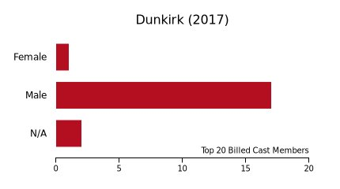

[Movie Gender Diversity Bot](https://www.twitter.com/moviediversity)
========

Visit the bot `@moviediversity`.

This is a Twitter bot that posts a bar chart of the breakdown by gender of movies. I grab the data from the Movie DB, a website similar to IMDB but with an API.

The bot has two functions:
1. Post a movie's breakdown on (or close to) its release date. 
	* This ensures that the movie will be in the public consciousness, hopefully leading to more exposure
	* This also ensures that the data will be as accurate as possible.
2. Reply to users who request an analysis of a specific movie.
	* The bot will also post the movie analysis to its timeline, if the movie had not been requested before.

How it Works
============

The bot was created with Javascript and is currently running on a Digital Ocean droplet. 

The process of creating an 'analysis' kicks off with a movie title. This title is fed into the MovieDB search API, after which the bot selects the movie that is the first result. Once there is a movie associated with the request, the bot grabs the cast members and aggregates the genders of the first 20 cast members. The cast members are billed accordingly to importance, so choosing the top 20 should lead to a accurate study, as minor characters with little screen time are not as relevant (though definitely still important!) This data then gets passed into a function that draws the bar chart on a Canvas (node-canvas helped with this). This canvas is exported as a dataURL which can then in turn be passed to Twitter. 

The Future
==========
* Expand analysis to include ethnicity information as well, in addition to other groups

Credits
=======

[The Movie DB](https://www.themoviedb.org/documentation/api)

Photo by Florian Klauer on Unsplash

Photo by Andrew Ridley on Unsplash